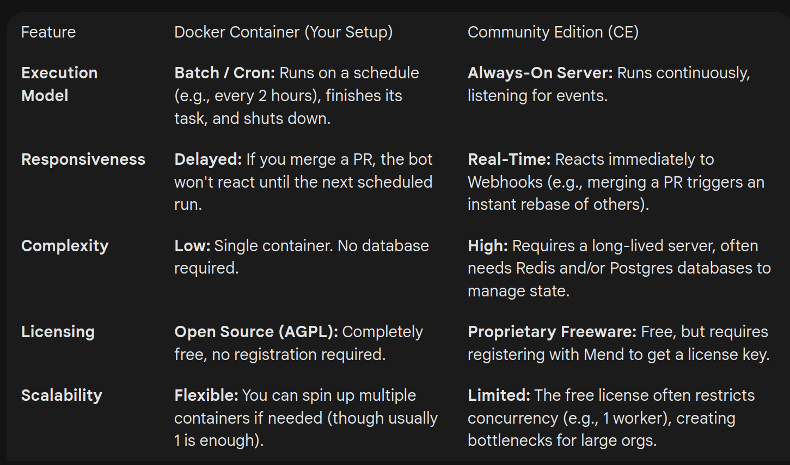

The Renovate software is actively maintained by its creators, Mend. It sees multiple commits and new releases daily, with hundreds of issues being tracked in the backlog. It is a highly popular tool with over 20k stars on GitHub, 250k+ weekly downloads on NPM, and over 1 billion Docker container pulls.

Renovate Distribution Options
1. NPM CLI

The core logic of Renovate, distributed as a Node.js package.

    Pros:

        Universal: Runs anywhere Node.js runs (local machine, any CI provider).

        Lightweight: You only install the package; ideal for quick scripts or custom pipeline integrations.

        Control: You decide exactly when it runs and with what flags.

    Cons:

        Dependency Hell: You are responsible for installing all the binary tools Renovate needs (e.g., updating Python projects requires Python installed; Gradle requires Java).

        No Scheduler: It runs once and exits. You must build your own loop or cron job.

        No Webhooks: It cannot react to events (like "PR merged"). It only reacts when you trigger it.

2. Docker Container (Your Current Setup)

This is effectively the NPM CLI packaged inside a container (using the renovate/renovate:full image).

    Pros:

        Battery-Included: Comes pre-installed with almost every package manager (Python, Go, Java, Composer, etc.), so you don't need to manage tools manually.

        Reproducible: The environment is identical every time it runs.

        CI/CD Ready: The standard way to run self-hosted Renovate in Kubernetes, GitHub Actions, or GitLab CI.

    Cons:

        Large Footprint: The "full" image is several gigabytes because it contains so many SDKs.

        Stateless/Batch: Designed to "run and die." It does not listen for webhooks. If a developer merges a PR, Renovate won't know until the next scheduled cron job.

        Infrastructure: You pay for the compute and manage the cron logic yourself.

3. GitHub App (Hosted by Mend)

The "SaaS" version installed from the GitHub Marketplace.

    Pros:

        Zero Maintenance: No servers, no cron, no updates to manage. Mend handles it all.

        Real-Time: Uses Webhooks to notice PR merges immediately and rebase remaining PRs instantly.

        Smart Dashboard: Provides a persistent "Dependency Dashboard" issue.

    Cons:

        Data Privacy: Metadata about your dependencies is processed on Mend's servers.

        Limits: Subject to the hosted platform's rate limits and queues.

        Less Customization: Harder to inject custom private CA certificates or modify the runtime environment.

4. Renovate Community Edition (CE) - "Mend Renovate"

A self-hosted server application designed to emulate the "GitHub App" experience on your own infrastructure.

    Pros:

        Interactive: Includes a Webhook Listener to respond to events in real-time.

        Built-in Scheduler: Has its own job queue; no external cron needed.

        Data Sovereignty: Keeps the "App" experience while keeping all data within your network.

    Cons:

        Complexity: Requires running a long-lived server (often with Redis/Postgres) rather than a simple batch job.

        Scalability: Typically limited in concurrency (often restricted to 1 worker), which causes backups if managing hundreds of repos.

5. Renovate Enterprise Edition (EE)

The paid, commercial self-hosted version.

    Pros:

        Horizontal Scaling: Can spin up unlimited "workers" to process thousands of repos in parallel.

        Smart Merge Control: Access to proprietary data (Merge Confidence) that predicts build breaks.

        Support & SLA: Official support from Mend.

    Cons:

        Cost: Requires a paid license.

        Operational Overhead: You manage a distributed system (Server + Worker fleet + Database).

Feature,Docker Container (Your Setup),Community Edition (CE)
Execution Model,"Batch / Cron: Runs on a schedule (e.g., every 2 hours), finishes its task, and shuts down.","Always-On Server: Runs continuously, listening for events."
Responsiveness,"Delayed: If you merge a PR, the bot won't react until the next scheduled run.","Real-Time: Reacts immediately to Webhooks (e.g., merging a PR triggers an instant rebase of others)."
Complexity,Low: Single container. No database required.,"High: Requires a long-lived server, often needs Redis and/or Postgres databases to manage state."
Licensing,"Open Source (AGPL): Completely free, no registration required.","Proprietary Freeware: Free, but requires registering with Mend to get a license key."
Scalability,Flexible: You can spin up multiple containers if needed (though usually 1 is enough).,"Limited: The free license often restricts concurrency (e.g., 1 worker), creating bottlenecks for large orgs."

The Demo Setup

We are running the self-hosted Docker distribution, pulling the renovate/renovate:43.10-full image.

The setup relies on two main configuration files:

    V2/config.js: Handles the bot's behavior (discovery, rules, limits).
                  If you were running renovate via, i.e., the CLI, this would be the equivalent the renovate.json(5) file.

    V2/.env: Stores the RENOVATE_TOKEN. This is a basic PAT with appropriate permissions.

Repository Management

Where do we manage which projects this is enabled on?

We handle this using a "developer opt-in" logic rather than a central whitelist.

    Auto-Discovery: In config.js, we have set autodiscover: true. This allows the bot to see every repository accessible by the GitHub token provided in the .env file.

    Filtering: We set requireConfig: "required". This is the filter. Even though the bot "sees" a repo, it will skip it entirely unless it finds a renovate.json file inside that specific repository.

    Onboarding: We have disabled the standard onboarding PRs (onboarding: false). The bot won't annoy teams by forcing itself into a repo. It waits passively until a developer adds the config file themselves.
    If onboarding was turned on, it would create a renovate.json configuration file in every repo it discovers that is missing it, and effectively activate itself on that respective repository.

This approach ensures developers decide on a repository level whether they want Renovate to manage their dependencies.

Scheduling and Execution

The bot is not set up to run as a continuous daemon. In compose.yaml, the restart policy is set to "no", meaning the container spins up, scans the repos, processes updates, and then shuts down.

To keep dependencies up to date, we can use i.e., cron, to trigger the instance. Every 2 - 4 hours is a common frequency.

Performance and Caching

    Caching: We map a volume named renovate_cache to /tmp/renovate inside the container. This persists data between runs so the bot doesn't have to re-download everything every time the cron job fires.

    Rate Limits: We have currently set prConcurrentLimit and prHourlyLimit to 0 in config.js. This effectively removes limits, allowing the bot to process as many PRs as needed without pausing.

